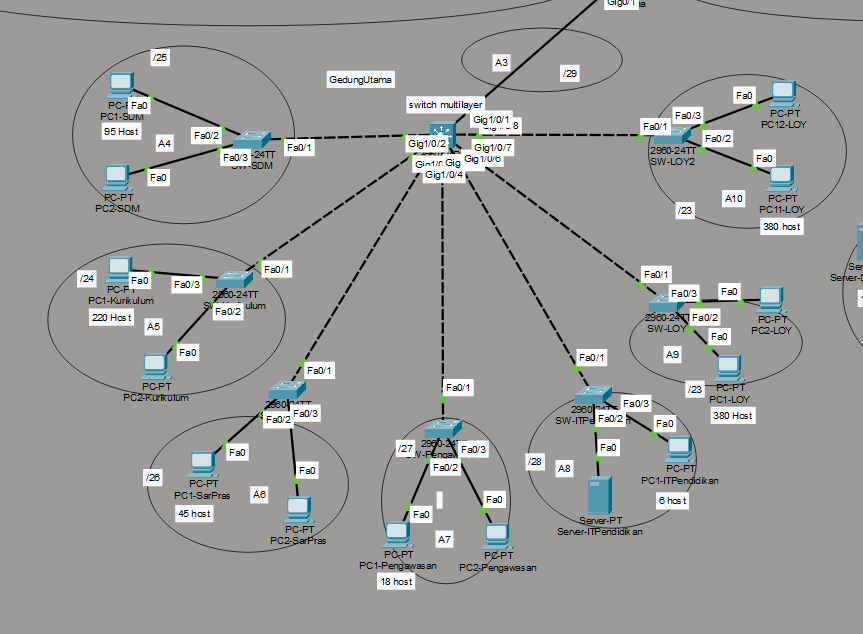
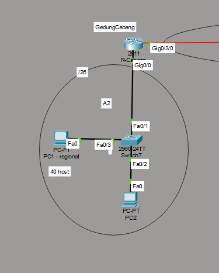
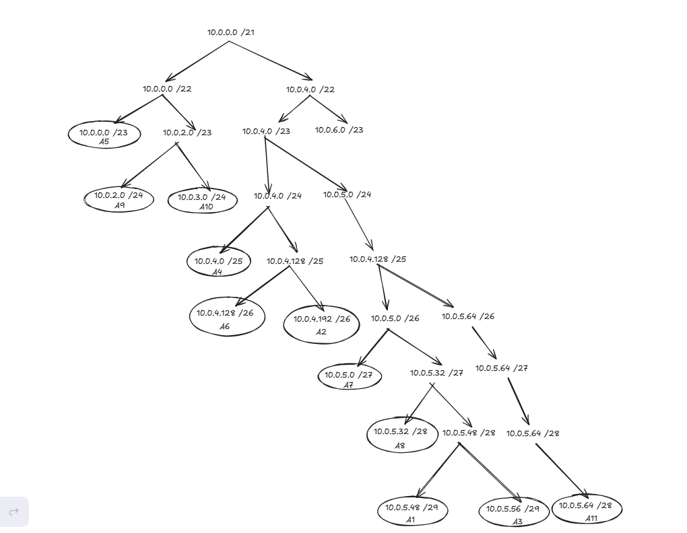
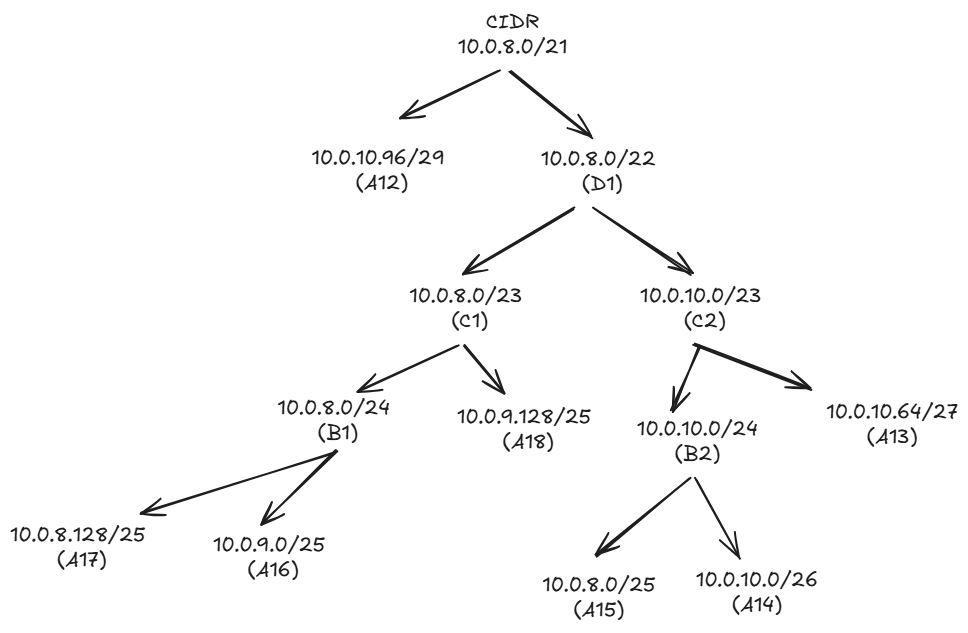
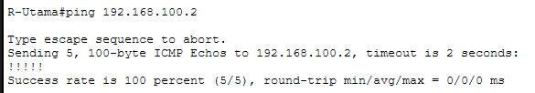
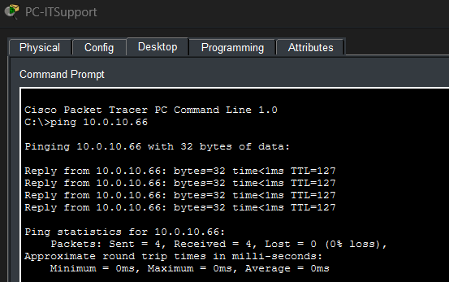
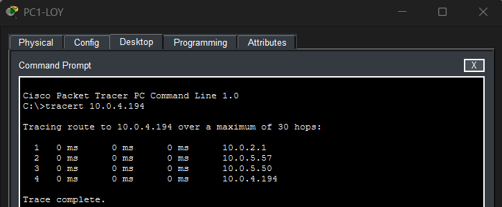
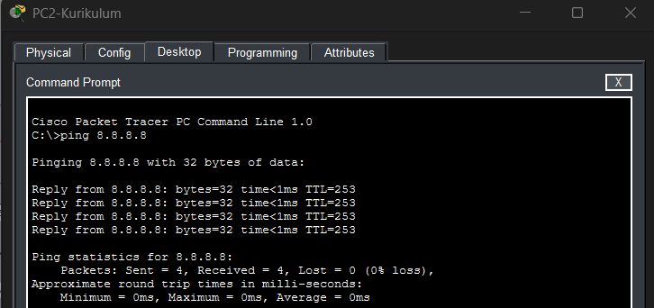

# 📋 LAPORAN FINAL PROJECT
## JARINGAN KOMPUTER - KELOMPOK K01

---

<div align="center">

### PERANCANGAN DAN IMPLEMENTASI INFRASTRUKTUR JARINGAN ENTERPRISE
### YAYASAN ARA

**Disusun untuk memenuhi tugas Final Project**
**Mata Kuliah Jaringan Komputer**

---

**Anggota Kelompok:**

| No | Nama Lengkap | NRP |
|:---:|:---|:---:|
| 1 | Aditya Reza Daffansyah | 5027241034 |
| 2 | Dimas Muhammad Putra | 5027241076 |
| 3 | Muhammad Khosyi Syehab | 5027241089 |
| 4 | Erlinda Annisa Zahra Kusuma | 5027241108 |

---

**14 Desember 2025**

</div>

---

## DAFTAR ISI

1. [BAB I - Pendahuluan](#bab-i---pendahuluan)
2. [BAB II - Topologi Jaringan](#bab-ii---topologi-jaringan)
3. [BAB III - Perancangan IP Address](#bab-iii---perancangan-ip-address)
4. [BAB IV - Implementasi](#bab-iv---implementasi)
5. [BAB V - Pengujian dan Verifikasi](#bab-v---pengujian-dan-verifikasi)
6. [BAB VI - Kesimpulan](#bab-vi---kesimpulan)
7. [Lampiran](#lampiran)

---

# BAB I - PENDAHULUAN

## 1.1 Latar Belakang

Yayasan ARA merupakan organisasi yang membawahi berbagai unit kerja di bidang pendidikan dan teknologi. Seiring dengan perkembangan organisasi, Yayasan ARA membangun sebuah gedung pusat teknologi bernama **ARA Tech** yang berfungsi sebagai kantor layanan digital. Dengan demikian, diperlukan infrastruktur jaringan yang mampu mengintegrasikan seluruh unit kerja di berbagai lokasi.

Proyek ini bertujuan untuk merancang dan mengimplementasikan infrastruktur jaringan yang menghubungkan:
- **Gedung Utama Yayasan ARA** - Pusat administrasi pendidikan
- **Gedung ARA Tech** - Pusat layanan digital dan teknologi
- **Kantor Cabang** - Regional office

## 1.2 Rumusan Masalah

1. Bagaimana merancang topologi jaringan yang tepat untuk menghubungkan 3 lokasi dengan kebutuhan host yang berbeda-beda?
2. Bagaimana mengalokasikan IP Address secara efisien menggunakan teknik VLSM dan CIDR?
3. Bagaimana mengkonfigurasi routing yang optimal menggunakan kombinasi Static dan Dynamic Routing?
4. Bagaimana memberikan akses internet ke seluruh perangkat menggunakan NAT Overload?
5. Bagaimana membuat koneksi virtual yang aman antar lokasi menggunakan GRE Tunnel?

## 1.3 Tujuan

1. Merancang topologi jaringan lengkap untuk 2 gedung utama dan 1 kantor cabang
2. Melakukan subnetting VLSM untuk Gedung Utama dan CIDR untuk Gedung ARA Tech
3. Mengimplementasikan DHCP dan IP Statis sesuai kebutuhan
4. Mengkonfigurasi Static dan Dynamic Routing (OSPF)
5. Mengimplementasikan NAT Overload untuk akses internet
6. Membangun GRE Tunnel antara Gedung Utama dan Kantor Cabang

## 1.4 Kebutuhan Host

### Gedung Utama Yayasan ARA

| No | Unit Kerja | Jumlah Host |
|:---:|:---|:---:|
| 1 | Unit SDM Pendidikan | 95 |
| 2 | Unit Kurikulum | 220 |
| 3 | Unit Sarpras | 45 |
| 4 | Unit Pengawasan Sekolah | 18 |
| 5 | Unit IT (Server) | 6 |
| 6 | Unit Layanan Operasional Yayasan | 380 |
| | **Total** | **764** |

### Gedung ARA Tech

| Lantai | Departemen | Jumlah Host | Keterangan |
|:---:|:---|:---:|:---|
| 1 | IT Support | 45 | - |
| 1 | Data Center | 12 | 12 Server |
| 1 | Cybersecurity | 22 | 2 Server |
| 2 | Marketing | 35 | - |
| 2 | Sales | 25 | - |
| 2 | Human Resources | 25 | - |
| 3 | Research & Development | 55 | 5 Server |
| 3 | People Development | 18 | - |
| 4 | Keuangan | 28 | - |
| 4 | Legal | 18 | - |
| 4 | Customer Service | 40 | - |
| 5 | Executive Office | 12 | - |
| 5 | Guest Lounge | 10 | - |
| 5 | Auditorium | 15 | - |
| | **Total** | **360** | |

### Kantor Cabang

| Unit | Jumlah Host |
|:---|:---:|
| Regional Office | 40 |

---

# BAB II - TOPOLOGI JARINGAN

## 2.1 Desain Arsitektur

Jaringan ini dirancang menggunakan arsitektur **three-tier hierarchy** yang terdiri dari:

| Layer | Fungsi | Perangkat |
|:---|:---|:---|
| **Core** | Pusat koneksi antar gedung dan akses internet | Router-Utama |
| **Distribution** | Routing antar VLAN dan agregasi traffic | DSW-Utama, DSW-ARA, R-ARATech, R-Cabang |
| **Access** | Koneksi langsung ke end devices | Switch Access (per VLAN) |

## 2.2 Topologi Keseluruhan

Berikut adalah diagram topologi fisik yang menghubungkan ketiga lokasi:


**Penjelasan:**
- **Router-Utama** berfungsi sebagai core router yang menghubungkan semua lokasi dan menyediakan akses internet
- **DSW-Utama** dan **DSW-ARA** adalah Layer 3 Switch yang menangani inter-VLAN routing
- Setiap lokasi terhubung dengan link point-to-point menggunakan subnet /29

## 2.3 Topologi Per Lokasi

### 2.3.1 Gedung Utama Yayasan ARA



**Komponen:**
- 1× Router (Router-Utama)
- 1× Layer 3 Switch (DSW-Utama)
- 7× VLAN untuk unit kerja
- 1× Server IT Pendidikan

### 2.3.2 Gedung ARA Tech


**Komponen:**
- 1× Router (Router-ARATech)
- 1× Layer 3 Switch (DSW-ARA)
- 6× VLAN untuk departemen
- 4× Server (DataCenter, RND, Cybersecurity)

### 2.3.3 Kantor Cabang



**Komponen:**
- 1× Router (Router-Cabang)
- 1× LAN untuk Regional Office
- DHCP Server terintegrasi di router

## 2.4 Skema Interkoneksi

| Koneksi | Subnet | Interface Router-Utama | Interface Tujuan |
|:---|:---|:---|:---|
| Router-Utama ↔ ISP | 203.0.113.0/24 | Gig0/0 (203.0.113.2) | ISP (203.0.113.1) |
| Router-Utama ↔ DSW-Utama | 10.0.5.56/29 | Gig0/1 (10.0.5.57) | Gig1/0/1 (10.0.5.58) |
| Router-Utama ↔ R-ARATech | 10.0.5.64/29 | Gig0/2/0 (10.0.5.65) | Gig0/3/0 (10.0.5.66) |
| Router-Utama ↔ R-Cabang | 10.0.5.48/29 | Gig0/3/0 (10.0.5.49) | Gig0/3/0 (10.0.5.50) |
| R-ARATech ↔ DSW-ARA | 10.0.10.96/29 | Gig0/0 (10.0.10.97) | Gig1/0/1 (10.0.10.98) |

---

# BAB III - PERANCANGAN IP ADDRESS

## 3.1 Subnetting VLSM - Gedung Utama

VLSM (Variable Length Subnet Masking) digunakan untuk mengalokasikan IP secara efisien berdasarkan kebutuhan host masing-masing unit kerja.

### 3.1.1 Metodologi Perhitungan

1. Urutkan kebutuhan host dari yang terbesar ke terkecil
2. Tambahkan cadangan ±20% untuk skalabilitas
3. Tentukan prefix yang sesuai dengan rumus: 2^n - 2 ≥ host
4. Alokasikan Network ID secara berurutan tanpa overlap

### 3.1.2 Tabel Alokasi IP VLSM

| No | Unit Kerja | Host Dibutuhkan | +20% Cadangan | Prefix | Network ID | Subnet Mask | Range IP | Broadcast Address | Host Tersedia |
|:---:|:---|:---:|:---:|:---:|:---|:---|:---|:---|:---:|
| 1 | Layanan Operasional 1 | 190 | 228 | /24 | 10.0.2.0 | 255.255.255.0 | 10.0.2.1 - 10.0.2.254 | 10.0.2.255 | 254 |
| 2 | Layanan Operasional 2 | 190 | 228 | /24 | 10.0.3.0 | 255.255.255.0 | 10.0.3.1 - 10.0.3.254 | 10.0.3.255 | 254 |
| 3 | Kurikulum | 220 | 264 | /23 | 10.0.0.0 | 255.255.254.0 | 10.0.0.1 - 10.0.1.254 | 10.0.1.255 | 510 |
| 4 | SDM Pendidikan | 95 | 114 | /25 | 10.0.4.0 | 255.255.255.128 | 10.0.4.1 - 10.0.4.126 | 10.0.4.127 | 126 |
| 5 | Sarpras | 45 | 54 | /26 | 10.0.4.128 | 255.255.255.192 | 10.0.4.129 - 10.0.4.190 | 10.0.4.191 | 62 |
| 6 | Pengawasan Sekolah | 18 | 22 | /27 | 10.0.5.0 | 255.255.255.224 | 10.0.5.1 - 10.0.5.30 | 10.0.5.31 | 30 |
| 7 | IT Pendidikan | 6 | 8 | /28 | 10.0.5.32 | 255.255.255.240 | 10.0.5.33 - 10.0.5.46 | 10.0.5.47 | 14 |

> **Catatan:** Unit Layanan Operasional Yayasan (380 host) dipecah menjadi 2 VLAN untuk mengoptimalkan broadcast domain dan meningkatkan performa jaringan.

### 3.1.3 Diagram VLSM



---

## 3.2 Subnetting CIDR - Gedung ARA Tech

CIDR (Classless Inter-Domain Routing) digunakan untuk Gedung ARA Tech dengan penerapan supernetting untuk menyederhanakan tabel routing.

### 3.2.1 Tabel Subnet Per Departemen

Beberapa departemen dengan fungsi terkait digabungkan dalam satu VLAN untuk efisiensi:

| No | VLAN ID | Nama VLAN | Departemen yang Digabung | Total Host | +20% | Prefix | Network ID | Subnet Mask | Range IP | Broadcast | Host Tersedia |
|:---:|:---:|:---|:---|:---:|:---:|:---:|:---|:---|:---|:---|:---:|
| 1 | 180 | ITSupp_Cysec | IT Support + Cysec | 67 | 81 | /25 | 10.0.9.128 | 255.255.255.128 | 10.0.9.129 - 10.0.9.254 | 10.0.9.255 | 126 |
| 2 | 130 | DataCenter | Data Center | 12 | 15 | /27 | 10.0.10.64 | 255.255.255.224 | 10.0.10.65 - 10.0.10.94 | 10.0.10.95 | 30 |
| 3 | 170 | Marketing_Sales | Marketing + Sales | 60 | 72 | /25 | 10.0.8.128 | 255.255.255.128 | 10.0.8.129 - 10.0.8.254 | 10.0.8.255 | 126 |
| 4 | 160 | PeopleDev_RND | R&D + People Dev | 73 | 88 | /25 | 10.0.9.0 | 255.255.255.128 | 10.0.9.1 - 10.0.9.126 | 10.0.9.127 | 126 |
| 5 | 150 | Keuangan_Legal | Keuangan + Legal + CS | 86 | 104 | /25 | 10.0.8.0 | 255.255.255.128 | 10.0.8.1 - 10.0.8.126 | 10.0.8.127 | 126 |
| 6 | 140 | Umum_Guest | Exec + Guest + Audit + HR | 62 | 75 | /26 | 10.0.10.0 | 255.255.255.192 | 10.0.10.1 - 10.0.10.62 | 10.0.10.63 | 62 |

### 3.2.2 Justifikasi Penggabungan VLAN

| Gabungan VLAN | Departemen | Alasan Penggabungan |
|:---|:---|:---|
| ITSupp_Cysec | IT Support (45) + Cysec (22) | Keduanya berada di Lantai 1 dengan fungsi terkait keamanan dan dukungan IT |
| Marketing_Sales | Marketing (35) + Sales (25) | Keduanya di Lantai 2 dengan fungsi bisnis yang saling terkait |
| PeopleDev_RND | R&D (55) + People Dev (18) | Keduanya di Lantai 3 dengan fokus pada pengembangan |
| Keuangan_Legal | Keuangan (28) + Legal (18) + CS (40) | Fungsi administratif dan layanan yang saling terkait |
| Umum_Guest | Exec (12) + Guest (10) + Audit (15) + HR (25) | Gabungan unit umum, tamu, dan fungsi pendukung |

### 3.2.3 Supernetting (Aggregation)

Proses supernetting dilakukan untuk menyederhanakan tabel routing antar gedung.

#### Tahap 1: Penggabungan Level B (Prefix /24)

| Blok | Gabungan Dari | Network ID | Prefix Baru | Range IP |
|:---|:---|:---|:---:|:---|
| B1 | A16 (PeopleDev_RND) + A17 (Marketing_Sales) | 10.0.8.0 | /24 | 10.0.8.0 - 10.0.8.255 |
| B2 | A14 (Umum) + A15 (Keuangan_Legal) | 10.0.10.0 | /24 | 10.0.10.0 - 10.0.10.255 |

#### Tahap 2: Penggabungan Level C (Prefix /23)

| Blok | Gabungan Dari | Network ID | Prefix Baru | Range IP |
|:---|:---|:---|:---:|:---|
| C1 | B1 + A18 (ITSupp_Cysec) | 10.0.8.0 | /23 | 10.0.8.0 - 10.0.9.255 |
| C2 | B2 + A13 (DataCenter) | 10.0.10.0 | /23 | 10.0.10.0 - 10.0.11.255 |

#### Tahap 3: Supernet Final (Prefix /21)

| Blok | Gabungan Dari | Network ID | Prefix Baru | Range IP | Keterangan |
|:---|:---|:---|:---:|:---|:---|
| D1 | C1 + C2 | 10.0.8.0 | /22 | 10.0.8.0 - 10.0.11.255 | Gabungan menengah |
| **E1** | D1 + A12 | **10.0.8.0** | **/21** | 10.0.8.0 - 10.0.15.255 | **Supernet ARA Tech** |

### 3.2.4 Diagram Pohon CIDR



---

## 3.3 Subnet Kantor Cabang

| Unit | Host | +20% | Prefix | Network ID | Subnet Mask | Range IP | Broadcast | Gateway |
|:---|:---:|:---:|:---:|:---|:---|:---|:---|:---|
| Regional Office | 40 | 48 | /26 | 10.0.4.192 | 255.255.255.192 | 10.0.4.193 - 10.0.4.254 | 10.0.4.255 | 10.0.4.193 |

---

## 3.4 Alokasi VLAN

### Gedung Utama (DSW-Utama)

| VLAN ID | Nama | Network | Gateway | Prefix |
|:---:|:---|:---|:---|:---:|
| 40 | SDM | 10.0.4.0 | 10.0.4.1 | /25 |
| 50 | Kurikulum | 10.0.0.0 | 10.0.0.1 | /23 |
| 60 | Sarpras | 10.0.4.128 | 10.0.4.129 | /26 |
| 70 | Pengawasan | 10.0.5.0 | 10.0.5.1 | /27 |
| 80 | ITPendidikan | 10.0.5.32 | 10.0.5.33 | /28 |
| 90 | LOY1 | 10.0.2.0 | 10.0.2.1 | /24 |
| 100 | LOY2 | 10.0.3.0 | 10.0.3.1 | /24 |

### Gedung ARA Tech (DSW-ARA)

| VLAN ID | Nama | Network | Gateway | Prefix |
|:---:|:---|:---|:---|:---:|
| 130 | DataCenter | 10.0.10.64 | 10.0.10.65 | /27 |
| 140 | Umum_Guest | 10.0.10.0 | 10.0.10.1 | /26 |
| 150 | Keuangan_Legal | 10.0.8.0 | 10.0.8.1 | /25 |
| 160 | PeopleDev_RND | 10.0.9.0 | 10.0.9.1 | /25 |
| 170 | Marketing_Sales | 10.0.8.128 | 10.0.8.129 | /25 |
| 180 | ITSupp_Cysec | 10.0.9.128 | 10.0.9.129 | /25 |

---

# BAB IV - IMPLEMENTASI

## 4.1 Konfigurasi Layer 3 Switching

Layer 3 Switch digunakan untuk melakukan **inter-VLAN routing** yang lebih efisien dibandingkan metode router-on-a-stick.

### Fitur yang Diimplementasikan:
- **IP Routing** - Mengaktifkan routing engine pada switch
- **VLAN Database** - Membuat database VLAN sesuai kebutuhan
- **SVI (Switch Virtual Interface)** - Membuat interface virtual sebagai gateway VLAN
- **Routed Port** - Mengkonfigurasi port uplink sebagai routed interface

> **File Konfigurasi:**
> - [DSW-Utama.sh](./4-ip-router-config/DSW-Utama.sh)
> - [DSW-ARA.sh](./4-ip-router-config/DSW-ARA.sh)

---

## 4.2 Konfigurasi DHCP

DHCP Server diimplementasikan langsung pada Layer 3 Switch untuk mendistribusikan IP address secara otomatis kepada client.

### Fitur yang Diimplementasikan:
- **IP Exclusion** - Mengamankan IP gateway dan server dari pool DHCP
- **DHCP Pool** - Mendefinisikan pool untuk setiap VLAN
- **Default Router** - Menentukan gateway untuk setiap pool
- **DNS Server** - Menggunakan 8.8.8.8 (Google DNS)

### Daftar Server dengan IP Statis

| Server | Lokasi | IP Address | Gateway |
|:---|:---|:---|:---|
| Server IT Pendidikan | Gedung Utama (VLAN 80) | 10.0.5.34 | 10.0.5.33 |
| Server DataCenter | ARA Tech (VLAN 130) | 10.0.10.66 | 10.0.10.65 |
| Server RND | ARA Tech (VLAN 160) | 10.0.9.2 | 10.0.9.1 |
| Server Cysec | ARA Tech (VLAN 180) | 10.0.9.130 | 10.0.9.129 |

> **File Konfigurasi:**
> - [Server-All-Config.sh](./4-ip-router-config/Server-All-Config.sh)

---

## 4.3 Konfigurasi Router

Setiap router dikonfigurasi dengan IP address pada interface yang terhubung ke perangkat lain.

### Router-Utama
Berfungsi sebagai core router dengan koneksi ke:
- Internet (ISP) via interface Gig0/0
- DSW-Utama via interface Gig0/1
- R-ARATech via interface Gig0/2/0
- R-Cabang via interface Gig0/3/0

> **File Konfigurasi:**
> - [Router-Utama.sh](./4-ip-router-config/Router-Utama.sh)
> - [Router-ARATech.sh](./4-ip-router-config/Router-ARATech.sh)
> - [Router-Cabang.sh](./4-ip-router-config/Router-Cabang.sh)
> - [ISP.sh](./4-ip-router-config/ISP.sh)

---

## 4.4 Konfigurasi Routing

Proyek ini menggunakan kombinasi **Static Route** dan **Dynamic Routing (OSPF)**.

### 4.4.1 Static Route

Digunakan untuk routing internal antara switch dan router dalam satu lokasi.

| Sumber | Tujuan | Next Hop | Keterangan |
|:---|:---|:---|:---|
| DSW-Utama | Semua network | 10.0.5.57 | Default route ke R-Utama |
| DSW-ARA | Semua network | 10.0.10.97 | Default route ke R-ARATech |
| R-Utama | VLAN Gedung Utama | 10.0.5.58 | Route ke DSW-Utama |
| R-ARATech | VLAN ARA Tech | 10.0.10.98 | Route ke DSW-ARA |

### 4.4.2 Dynamic Routing (OSPF)

OSPF Area 0 digunakan untuk pertukaran informasi routing antar router.

| Router | Network yang Di-advertise | Fitur Tambahan |
|:---|:---|:---|
| R-Utama | 10.0.5.48/29, 10.0.5.56/29, 10.0.5.64/29 | redistribute static, default-information originate |
| R-ARATech | 10.0.5.64/29, 10.0.10.96/29 | redistribute static |
| R-Cabang | 10.0.5.48/29, 10.0.4.192/26 | - |

> **File Konfigurasi:**
> - [5-routing/Router-Utama.sh](./5-routing/Router-Utama.sh)
> - [5-routing/Router-ARATech.sh](./5-routing/Router-ARATech.sh)
> - [5-routing/Router-Cabang.sh](./5-routing/Router-Cabang.sh)
> - [5-routing/DSW-Utama.sh](./5-routing/DSW-Utama.sh)
> - [5-routing/DSW-ARA.sh](./5-routing/DSW-ARA.sh)

---

## 4.5 Konfigurasi NAT Overload (PAT)

NAT Overload memungkinkan semua perangkat internal mengakses internet menggunakan satu IP public.

### Konsep Implementasi

```
[Client Internal]     [Router-Utama]        [Internet]
   10.0.x.x      →    203.0.113.2      →    8.8.8.8
                      (NAT Translation)
```

### Detail Konfigurasi

| Komponen | Nilai |
|:---|:---|
| Access List | permit 10.0.0.0 0.255.255.255 |
| NAT Outside | GigabitEthernet0/0 |
| NAT Inside | Gig0/1, Gig0/2/0, Gig0/3/0 |
| NAT Type | Overload (PAT) |

> **File Konfigurasi:** [6-nat-overload/Router-Utama.sh](./6-nat-overload/Router-Utama.sh)

---

## 4.6 Konfigurasi GRE Tunnel

GRE Tunnel menciptakan koneksi virtual point-to-point antara Gedung Utama dan Kantor Cabang.

### Parameter Tunnel

| Parameter | Router-Utama | Router-Cabang |
|:---|:---|:---|
| Interface | Tunnel0 | Tunnel0 |
| IP Address | 192.168.100.1/30 | 192.168.100.2/30 |
| Tunnel Source | GigabitEthernet0/3/0 | GigabitEthernet0/3/0 |
| Tunnel Destination | 10.0.5.50 | 10.0.5.49 |

### Diagram GRE Tunnel



> **File Konfigurasi:**
> - [7-gre-tunnel/Router-Utama.sh](./7-gre-tunnel/Router-Utama.sh)
> - [7-gre-tunnel/Router-Cabang.sh](./7-gre-tunnel/Router-Cabang.sh)

---

# BAB V - PENGUJIAN DAN VERIFIKASI

## 5.1 Pengujian Inter-VLAN Routing

**Tujuan:** Memverifikasi bahwa perangkat di VLAN berbeda dapat saling berkomunikasi.

**Skenario:** Ping dari PC di VLAN 180 (ITSupport) ke Server di VLAN 130 (DataCenter)

| Source | Destination | Hasil |
|:---|:---|:---:|
| PC ITSupport (10.0.9.131) | Server DataCenter (10.0.10.66) | Berhasil |



**Analisis:** Inter-VLAN routing berhasil dilakukan oleh Layer 3 Switch (DSW-ARA) melalui SVI.

---

## 5.2 Pengujian Koneksi Antar Gedung

**Tujuan:** Memverifikasi bahwa routing OSPF berfungsi untuk menghubungkan lokasi berbeda.

**Skenario:** Traceroute dari PC LOY1 (Gedung Utama) ke PC Cabang



**Path yang dilalui:**
```
PC LOY1 → DSW-Utama → Router-Utama → Router-Cabang → PC Cabang
```

**Analisis:** OSPF berhasil mengadvertise route antar router sehingga komunikasi end-to-end tercapai.

---

## 5.3 Pengujian Akses Internet (NAT)

**Tujuan:** Memverifikasi bahwa NAT Overload berfungsi untuk memberikan akses internet.

**Skenario:** Ping ke 8.8.8.8 (Google DNS) dari PC internal



| Source | Destination | Hasil |
|:---|:---|:---:|
| PC Internal (10.0.x.x) | 8.8.8.8 | Berhasil |

**Verifikasi NAT Translation:**
```
show ip nat translations
```

**Analisis:** NAT Overload berhasil menerjemahkan IP private ke IP public untuk akses internet.

---

## 5.4 Pengujian GRE Tunnel

**Tujuan:** Memverifikasi bahwa GRE Tunnel terbentuk antara Router-Utama dan Router-Cabang.

**Skenario:** Ping antar tunnel interface

| Source | Destination | Hasil |
|:---|:---|:---:|
| R-Utama (192.168.100.1) | R-Cabang (192.168.100.2) | Berhasil |

**Analisis:** GRE Tunnel berhasil terbentuk dan dapat digunakan untuk komunikasi virtual.

---

## 5.5 Ringkasan Pengujian

| No | Test Case | Deskripsi | Hasil | Status |
|:---:|:---|:---|:---:|:---:|
| 1 | Inter-VLAN Routing | Ping antar VLAN berbeda | Success | V |
| 2 | Koneksi Utama - ARA | Ping dari Gedung Utama ke ARA Tech | Success | V |
| 3 | Koneksi Utama - Cabang | Ping dari Gedung Utama ke Cabang | Success | V |
| 4 | Akses Internet | Ping ke 8.8.8.8 dari PC internal | Success | V |
| 5 | GRE Tunnel | Ping antar tunnel interface | Success | V |
| 6 | DHCP Assignment | PC mendapat IP otomatis | Success | V |

---

# BAB VI - KESIMPULAN

## 6.1 Kesimpulan

Berdasarkan implementasi dan pengujian yang telah dilakukan, dapat disimpulkan bahwa:

1. **Topologi Jaringan** - Arsitektur three-tier hierarchy berhasil diterapkan untuk menghubungkan 3 lokasi (Gedung Utama, ARA Tech, dan Kantor Cabang) dengan efektif.

2. **Subnetting** - Teknik VLSM dan CIDR berhasil diterapkan untuk mengalokasikan IP address secara efisien dengan cadangan ±20% untuk skalabilitas.

3. **Inter-VLAN Routing** - Layer 3 Switch berhasil melakukan routing antar VLAN dengan performa yang optimal.

4. **DHCP** - Distribusi IP address otomatis berfungsi dengan baik di semua VLAN.

5. **Routing** - Kombinasi Static Route dan OSPF berhasil menyediakan konektivitas end-to-end di seluruh jaringan.

6. **NAT Overload** - Semua perangkat internal berhasil mengakses internet melalui NAT translation.

7. **GRE Tunnel** - Koneksi virtual antara Gedung Utama dan Kantor Cabang berhasil dibuat.

---

# LAMPIRAN

## Daftar File yang Dikumpulkan

| No | Nama File | Deskripsi |
|:---:|:---|:---|
| 1 | FP-Jarkom.pkt | File simulasi Cisco Packet Tracer |
| 2 | README.md | Dokumentasi lengkap |
| 3 | assets/ | Folder berisi gambar topologi dan screenshot |
| 4 | 4-ip-router-config/ | Script konfigurasi IP dan DHCP |
| 5 | 5-routing/ | Script konfigurasi routing |
| 6 | 6-nat-overload/ | Script konfigurasi NAT |
| 7 | 7-gre-tunnel/ | Script konfigurasi GRE Tunnel |
| 8 | Kelompok 1_FP Jarkom.xlsx | Tabel subnet |

## Struktur Folder

```
Jarkom-FP-K01/
├── FP-Jarkom.pkt
├── README.md
├── assets/
│   ├── topologi.png
│   ├── 1-topologi-utama.png
│   ├── 1-topologi-ARA.png
│   ├── 1-topologi-cabang.png
│   ├── VLSM.png
│   ├── TREE_CIDR.png
│   ├── 5-ping-itsupport-serverdatcen.png
│   ├── 5-traceroute-loy-cabang.png
│   ├── 6-ping-internet.png
│   └── 7-gre-tunnel.png
├── 4-ip-router-config/
│   ├── DSW-Utama.sh
│   ├── DSW-ARA.sh
│   ├── Router-Utama.sh
│   ├── Router-ARATech.sh
│   ├── Router-Cabang.sh
│   ├── ISP.sh
│   └── Server-All-Config.sh
├── 5-routing/
│   ├── Router-Utama.sh
│   ├── Router-ARATech.sh
│   ├── Router-Cabang.sh
│   ├── DSW-Utama.sh
│   └── DSW-ARA.sh
├── 6-nat-overload/
│   └── Router-Utama.sh
└── 7-gre-tunnel/
    ├── Router-Utama.sh
    └── Router-Cabang.sh
```

---

<div align="center">

**Laporan ini dibuat sebagai dokumentasi Final Project Jaringan Komputer**

**Kelompok K01 - 14 Desember 2025**

</div>
